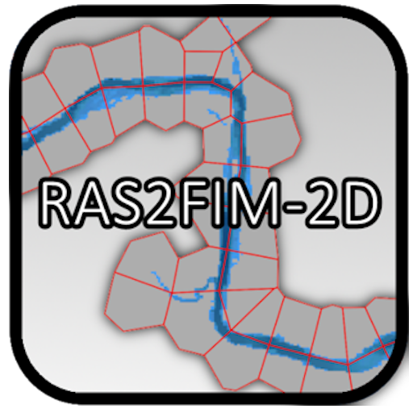
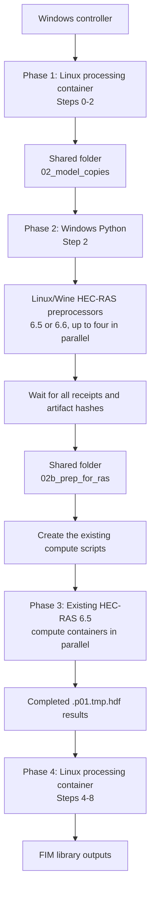

# RAS2FIM-2D  <br> <br>

## <i>Flood Inundation Mapping using HEC-RAS 2D</i>




**RAS2FIM-2D** converts 2D HEC-RAS models into flood inundation mapping (FIM) libraries for National Water Model (NWM) NextGen stream segments represented within the HEC-RAS model's 2D computational area.

The workflow uses a "firehose" approach in which a series of constant-flow simulations is performed by applying flow to an internal HEC-RAS boundary condition named `Emitter1`. Flows are introduced near the upstream ends of the NWM NextGen hydrofabric catchments and the resulting inundation is clipped to the area associated with the corresponding NextGen `feature_id` (for example, `wb-2427467`).

The resulting FIM library contains water-surface elevations (WSEL) indexed by flow rate (cfs). The output NetCDF files also contain the terrain used by HEC-RAS to compute the water-surface elevations.

This project was developed in support of the National Weather Service under **Research Project NA22NWS4320003 / A25-0366-S018**.


---

## Status

**Version:** 0.1 — Preliminary release
**Release date:** 2026-09-07

---

## Technology

- Python 3.8.12
- HEC-RAS 2D (v6.5 Linux/Wine preprocessing; v6.5 containerized compute workers)
- Docker
- NetCDF
- GDAL / raster processing libraries

---

## Related Project

[NOAA-OWP/ras2fim](https://github.com/NOAA-OWP/ras2fim) — Flood Inundation Maps generated from HEC-RAS 1D models.

---

# HEC-RAS 2D Requirements

The base HEC-RAS model must meet the following requirements:

- **Internal Boundary Condition:** An internal boundary condition named `Emitter1` must be present within the 2D flow area.
- **Flow Hydrograph:** The flow hydrograph for `Emitter1` must be configured to **Use Simulation Time**.
- **Computation Interval:** Spawned simulations inherit the computation interval from the base HEC-RAS unsteady plan.
- **Projection:** The HEC-RAS projection file must be located in the same directory as the base HEC-RAS model.
- **Terrain:** The terrain file used by the HEC-RAS model must be accessible from the base HEC-RAS model directory.

---

# Sample Data

Sample HEC-RAS input data and RAS2FIM-2D output data are provided separately from the source repository.

### Browse the sample data

**[RAS2FIM-2D Sample Data](https://rasfim-2d-sample.s3.amazonaws.com/index.html)**

The sample data are hosted in an Amazon S3 bucket:

```
s3://rasfim-2d-sample
```

The sample dataset includes representative HEC-RAS 2D input files and RAS2FIM-2D output files that can be used to test the workflow and examine the resulting FIM products.

> **Note:** The sample data are intentionally hosted separately from the GitHub repository because HEC-RAS model inputs and FIM outputs can be relatively large.

---

# Installation (Getting Ready to Run)

The RAS2FIM-2D stack runs across Windows and a Linux Docker host:

- **Linux Docker containers** — run the Python processing steps, parallel HEC-RAS preprocessing through Wine, and the existing HEC-RAS compute workers.
- **Windows + conda (miniforge)** — controls each phase and accesses the same work folder as the Linux host.

Complete all four setup steps before running the pipeline.

### 1. Prepare the HEC-RAS v6.5 Wine profile (Linux host)

Create the read-only HEC-RAS v6.5 Wine runtime profile described in [container documentation](containers/hecras-prepare/README.md), using the official installer and accepting its displayed Terms and Conditions for Use. The profile must retain an accepted HEC-RAS user state. Before each headless launch, ras-commander explicitly transfers that state to the selected installed version in the disposable job profile and verifies the target state. The licensed runtime stays outside this repository and outside the preprocessing image. Windows does not run HEC-RAS locally.

### 2. Install `nccopy` (local Windows machine)

Install `nccopy` (from the Unidata netCDF utilities) on the local Windows machine and ensure it is available on the system `PATH`.

### 3. Pull the Docker images

```
docker pull rascommander/hec-ras-wine-precompute_6.5@sha256:0eb3aa3dbd1cb174651bf74196ac66b448acd0fb4dbdcb5852d664da521ea7ca
docker pull civileng127/ras_v65:v0
docker pull civileng127/ras2fim2d:v01
```

- `rascommander/hec-ras-wine-precompute_6.5` — HEC-RAS 6.5 preprocessing through Wine on Linux.
- `civileng127/ras_v65:v0` — the existing HEC-RAS 6.5 Linux runtime used by the parallel compute workers. See **[Docker Hub — HEC-RAS Linux v6.5](https://hub.docker.com/r/civileng127/ras_v65)**.
- `civileng127/ras2fim2d:v01` — RAS2FIM-2D Python processing environment.

### 4. Clone the repository and build the conda environment (Windows)

The example below uses **miniforge**. Adjust the working directory to suit your machine.

```
cd C:\Users\civil\dev
git clone https://github.com/andycarter-pe/ras2fim-2d.git
cd ras2fim-2d
conda env create -f environment_ras2fim2d.yml
```

---

# How to Run the Stack

The pipeline is executed in four phases. Steps `0`–`8` are selected with the `-s "(start,end)"` argument, so each phase runs a contiguous range of steps.

> **Substitute your own paths.** The commands below use example input/output locations:
> - Model input: `D:\to_aws_20260908\HEC-RAS`
> - Model output: `E:\mac_test_output_20260909`
>
> Replace these with the paths to your HEC-RAS model directory and your desired output directory.

The work folder is shared by both hosts. Windows waits for the complete preprocessing batch before it creates the unchanged compute scripts.



### Argument reference

| Argument | Meaning |
|----------|---------|
| `-i` | Input directory (the base HEC-RAS 2D model). Mounted as `/model_input` in the container. |
| `-o` | Output directory for RAS2FIM-2D products. Mounted as `/model_output` in the container. |
| `-c` | Configuration file (`config_global.ini` in the Linux container; `config_global_windows.ini` for the Windows run). |
| `-f` | Feature-selection tuple, e.g. `"(1,1,1)"`. |
| `-s` | Step range to execute as `"(start,end)"`, e.g. `"(0,2)"`, `"(2,2)"`, `"(4,8)"`. |

---

## Phase 1 — Steps 0 to 2 (Linux Docker container)

Runs the initial processing steps that prepare the model and set up the HEC-RAS runs.

```
docker run -it ^
  -v D:\to_aws_20260908\HEC-RAS:/model_input ^
  -v E:\mac_test_output_20260909:/model_output ^
  civileng127/ras2fim2d:v01 ^
  python ras2fim-2d.py -i /model_input -o /model_output -c config_global.ini -f "(1,1,1)" -s "(0,2)"
```

> The `^` characters are Windows line-continuation and are optional — the command can be entered on a single line.

---

## Phase 2 — Create the temporary HDF files on the Linux Docker host

The Windows Phase 2 command below does not change. Configure the Linux host,
the Windows and Linux names for the shared work folder, the Wine profile, and
the immutable preparation image in `config_global_windows.ini`.

For example, the configured roots translate
`E:\mac_test_output_video\02_model_copies\model` to
`/mnt/ras2fim-2d-work/mac_test_output_video/02_model_copies/model`.
Step 2b applies that mapping to every generated project, starts up to four
two-core preparation containers over SSH, and waits for all of them. After all
receipts and artifact hashes pass validation, it stages each `.p01.tmp.hdf`,
`.b01`, and `.x01` file and writes the existing compute scripts. The container
command does not need to be run manually for each project.

```ini
[03_run_hec_ras]
str_linux_host = user@linux-host
str_windows_share = E:\
str_linux_share = /mnt/ras2fim-2d-work
str_prepare_image = rascommander/hec-ras-wine-precompute_6.5@sha256:0eb3aa3dbd1cb174651bf74196ac66b448acd0fb4dbdcb5852d664da521ea7ca
str_prepare_version = 6.5
str_wine_profile = /opt/hec-ras/profiles/wine-6.5
int_prepare_cores_per_job = 2
int_prepare_memory_gb = 6
b_use_ntsync = True
```

```
conda activate ras2fim2d
python C:\Users\civil\dev\ras2fim-2d\src\ras2fim-2d.py -i D:\to_aws_20260908\HEC-RAS -o E:\mac_test_output_20260909 -c C:\Users\civil\dev\ras2fim-2d\src\config_global_windows.ini -f "(1,1,1)" -s "(2,2)"
```

---

## Phase 3 — Step 3 (Windows batch: parallel HEC-RAS workers)

Phase 2 generates batch and TACC scripts in the output directory. Run it to launch the HEC-RAS compute jobs. This runs **four (4)** `civileng127/ras_v65:v0` HEC-RAS Docker workers concurrently.

```
E:\mac_test_output_20260909\02b_prep_for_ras\run_docker_windows_parallel.bat
```

> **Observed validation runtime:** approximately **44–49 minutes** per sample run with two CPUs and 6 GiB. Runtime varies with host hardware and concurrent load.

---

## Phase 4 — Steps 4 to 8 (Linux Docker container)

Post-processes the HEC-RAS results into the final flood inundation mapping (FIM) library.

```
docker run -it ^
  -v D:\to_aws_20260908\HEC-RAS:/model_input ^
  -v E:\mac_test_output_20260909:/model_output ^
  civileng127/ras2fim2d:v01 ^
  python ras2fim-2d.py -i /model_input -o /model_output -c config_global.ini -f "(1,1,1)" -s "(4,8)"
```

---

# Docker (Reference)

RAS2FIM-2D uses Docker to provide a reproducible processing environment. HEC-RAS v6.5 preprocessing runs through the [Linux/Wine preprocessing image](containers/hecras-prepare/README.md), contributed by CLB Engineering Corporation. The subsequent simulations use the existing containerized HEC-RAS 6.5 runtime.

## Build the RAS2FIM-2D image (optional, for developers)

A `Dockerfile` is included in this repository. Instead of pulling the pre-built `civileng127/ras2fim2d:v01` image, you can build it locally:

```
docker build -t ras2fim2d .
```

---

# Output

RAS2FIM-2D produces flood inundation mapping libraries containing water-surface elevations associated with multiple flow rates.

The primary output is a NetCDF file containing:

- Water-surface elevation (WSEL)
- Flow rate associated with each WSEL
- Terrain data used by the HEC-RAS simulation
- Spatial information required to interpret the results

The output can be used as a library for rapidly retrieving flood inundation information for NWM NextGen stream segments.

---

# License

See the repository license for terms of use.
