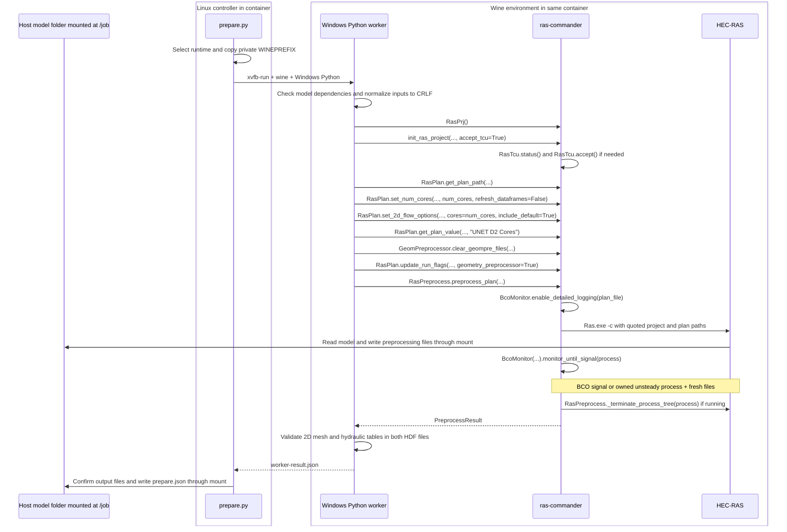

# HEC-RAS 6.5 Wine preprocessing

**HEC-RAS 6.5 is installed with Windows Python, dependencies, and saved TCU acceptance.**

**Qualification status:** The matching image pairs passed the full 266-hour Linux sample and one-hour Windows Docker Desktop notebook at two CPUs per container, including progress, resume and batch checks. The [current release record][host-tests] gives the results and limits. Published as `v4` and `latest`; anonymous digest pulls are verified.

This Linux/amd64 container lets [ras-commander][rc] call installed Windows
HEC-RAS through Wine. HEC-RAS performs the preprocessing. The container
provides the runtime and access to the host model folder.

## Models created on Windows or Linux

Pull the matching current image before running. Use a disposable model copy and
mount its terrain and projection folders. With a model at `/job`, references
to `..\source_terrain` need `/source_terrain`; `..\projection` needs `/projection`.
The terrain HDF also needs its referenced TIFF files.

[model_checks.py][build-checks] checks the selected inputs, existing 2D geometry,
projection, terrain HDF and rasters before modifying model files. It normalizes
the selected `.prj`, `.p##`, `.g##` and `.u##` to Windows CRLF, preserving other
bytes. LF, CRLF and mixed inputs are accepted. The generated `.x##` remains LF.

Success requires both output HDFs to retain 2D areas and cell counts and contain
valid cell-volume and face-area elevation tables. Receipts record these checks.
File size and `/Results` presence are insufficient. See the
[full operating guide](https://github.com/gpt-cmdr/ras2fim-2d/blob/codex/phase2-linux-wine-preprocessing/containers/hecras-prepare/OPERATION.md).


## Wine, the HEC-RAS installation, and host data

[Wine](https://www.winehq.org/) supplies Windows application interfaces on Linux. It lets Windows Python
and the installed Windows HEC-RAS programs run inside this Linux container.
[ras-commander][rc] runs in Windows Python and calls HEC-RAS. HEC-RAS performs
the preprocessing; the container supplies the operating environment.

### Where HEC-RAS is installed

A Wine *prefix* is a directory holding a Windows-style C: drive, installed
programs, supporting DLLs, and Windows registry files. The image contains a
prepared prefix at `/runtime/wine-seed/prefix` and its settings in
`/runtime/wine-seed/runtime.json`.

| View | Installed executable path |
|---|---|
| Windows path seen by HEC-RAS and Python | `C:\Program Files (x86)\HEC\HEC-RAS\6.5\Ras.exe` |
| Linux path inside the image template | `/runtime/wine-seed/prefix/drive_c/Program Files (x86)/HEC/HEC-RAS/6.5/Ras.exe` |
| Linux path used by one running job | `/run/ras-job/<run-id>/wineprefix/drive_c/Program Files (x86)/HEC/HEC-RAS/6.5/Ras.exe` |

At startup the wrapper copies the prepared prefix into the job's private
scratch directory and sets `WINEPREFIX` to that copy. Wine can update its
registry and temporary state there. The worker reads the installed template
when making the copy, and directs normal job updates to the copy. UID 1000
cannot write the root-owned template; a container run as root could.
Windows Python is `C:\Python311\python.exe`; Xvfb supplies a virtual screen
for the Windows application. No interactive desktop is needed for a prepared job.

### How inputs and outputs cross the host mount


For example, `--mount type=bind,src=/shared/model,dst=/job` makes the Docker
host's `/shared/model` directory visible inside the container as `/job`.
These are **the same underlying files**. There is no upload at startup or
separate download at completion: opening `/job/model.prj` reads the host file,
and writing `/job/model.p01.tmp.hdf` writes into the host directory.

Wine's Z: drive maps the container's Linux filesystem, so `winepath -w` can
translate `/job/model.prj` to `Z:\job\model.prj`. That drive sees the container's
filesystem and mounted folders. It does not expose unmounted host directories.

| Location | What happens to its files |
|---|---|
| Host model folder mounted at `/job` | Read/write. Inputs, edited plans, generated files, logs, and receipts remain on the host after the container exits. |
| Referenced terrain/projection mounts | Usually read-only; their mounted paths must match the model's references. |
| `/runtime/wine-seed` | Root-owned installed template; the worker copies it for each job. Root could modify it. |
| `/run/ras-job/<run-id>` | Private Wine prefix and worker files in the container's writable layer for the standard API/CLI launch. |
| `/tmp` | Temporary files in the container's writable layer for the standard API/CLI launch. |

Docker resolves bind-mount source paths on the daemon's host.

Use a disposable copy and `--user root` for the qualified Windows Docker Desktop route. The job edits preprocessing
settings and can replace generated files, including an existing final plan HDF
when `--replace-generated` is set. The documented `--rm` run removes the
container and its writable layer; the bind-mounted model folder remains.

## Run a preprocessing job

```bash
docker pull rascommander/hec-ras-wine-precompute_6.5:v4

docker run --rm --pull always --user root --cpus 2 \
  --mount "type=bind,src=/path/model,dst=/job" \
  --mount "type=bind,src=/path/source_terrain,dst=/source_terrain,readonly" \
  --mount "type=bind,src=/path/projection,dst=/projection,readonly" \
  rascommander/hec-ras-wine-precompute_6.5:v4 \
  prepare --project /job/model.prj --plan 01 --num-cores 2 --timeout 900 --replace-generated
```

Replace the source paths and project filename. In WSL use `/mnt/c/...` paths.
For Windows Docker Desktop, use Windows source paths and one command line.
The published images passed the one-hour notebook on Windows paths containing spaces. See the [Windows command and Linux options][host-guide] and [test record][host-tests].

Review and agree to the [HEC-RAS Terms and Conditions for Use](https://www.hec.usace.army.mil/confluence/rasdocs/rasum/6.6/terms-and-conditions-of-use).
Vendor notices remain in the profile.

## CPU settings

The worker accepts `--num-cores N`, default 2, integer range 1-8. Pass
Docker `--cpus N` with the same count. Docker limits shared CPU time; the worker
uses [RasPlan.set_num_cores()][plan-cores] and
[RasPlan.set_2d_flow_options()][plan-2d] with `include_default=True` to set the
plan and each 2D mesh, then [reads the explicit setting back][plan-value]. The
receipt records `arguments.num_cores`. One container prepares one plan; batch
scheduling stays on the host.

The two-core setting passed the Linux full-plan and Windows one-hour sample qualification. The command above sets the same count in Docker and HEC-RAS.

## Installed code and GitHub source

The controller links identify source commit
`dc60b219091e85bcb4564eca45313475c39ce58a`, used for the CPU-aligned source
build described here. Its installed files were checked against that source.

| Installed file | Source and purpose |
|---|---|
| `/opt/hecras-prepare/prepare.py` | [prepare.py][build-controller]: Linux job controller. |
| `/opt/hecras-prepare/model_checks.py` | [model_checks.py][build-checks]: model input and HDF validation. |
| `/opt/hecras-prepare/windows_worker.py` | [windows_worker.py][build-worker]: calls [ras-commander][rc]. |
| `C:\ras2fim-runtime\verify_windows_runtime.py` | [profile_provenance_check_legacy.py][build-helper]: unused preparation helper retained in the runtime. |

The library is installed under `C:\Python311\Lib\site-packages\ras_commander`.
Exact installed source: [RasPrj.py][ras-prj], [RasPlan.py][plan-path],
[geom/GeomPreprocessor.py][clear-geom], [RasPreprocess.py][preprocess],
[RasTcu.py][tcu-status], [RasBco.py][bco], and [ComputeResults.py][result].
All 239 package files in the retained 0.99.2 wheel match public commit
`9e4217713e954236b0c16023e1815c6f2b7a5309` after normalizing line endings. The
[complete installed package source](https://github.com/gpt-cmdr/ras-commander/tree/9e4217713e954236b0c16023e1815c6f2b7a5309/ras_commander) is inspectable on GitHub.

## Exact ras-commander call sequence

The tables link every [ras-commander][rc] function shown below to the exact
installed source. The calls below describe the qualified image.



If Mermaid is unavailable in your viewer, the sequence is: Linux wrapper ->
Windows Python under Wine -> [ras-commander][rc] -> HEC-RAS -> files in the host
mount. The worker returns its result to the wrapper, which writes the job receipt.

| Direct worker API, in order | Actual arguments and purpose |
|---|---|
| [RasPrj()][ras-prj] | Creates the project object passed to subsequent calls as `ras_object`. |
| [init_ras_project()][init] | `project`, `ras_version=ras_executable`, `ras_object=ras_object`, `load_results_summary=False`, `load_hdf_metadata=False`, `hide_intro=True`, `accept_tcu=True`. Selects the installed executable and initializes project data. |
| [RasPlan.get_plan_path()][plan-path] | `plan, ras_object=ras_object`. Resolves the selected plan file; a missing plan stops the worker. |
| [RasPlan.set_num_cores()][plan-cores] | `plan_path, num_cores, ras_object=ras_object, refresh_dataframes=False`. Sets existing 1D, 2D, and pipe-system core entries before preprocessing. |
| [RasPlan.set_2d_flow_options()][plan-2d] | `plan_path, cores=num_cores, include_default=True, ras_object=ras_object`. Sets every named 2D mesh and the existing default block, inserting missing 2D core entries. |
| [RasPlan.get_plan_value()][plan-value] | `plan_path, "UNET D2 Cores", ras_object=ras_object`. Confirms an explicit 2D count before HEC-RAS starts. |
| [GeomPreprocessor.clear_geompre_files()][clear-geom] | `plan_path, ras_object=ras_object`. Clears the matching geometry preprocessing cache and refreshes geometry metadata. |
| [RasPlan.update_run_flags()][run-flags] | `plan_path, geometry_preprocessor=True, ras_object=ras_object`. Enables geometry preprocessing in the working plan. |
| [RasPreprocess.preprocess_plan()][preprocess] | `plan, ras_object=ras_object, max_wait=timeout, clear_existing=replace_generated, fix_line_endings=True`. Starts and supervises HEC-RAS and returns its preprocessing result. |

| Calls and result used inside the library | Role |
|---|---|
| [RasTcu.status()][tcu-status] | Checks saved Terms and Conditions for Use acceptance for the selected executable. |
| [RasTcu.accept()][tcu-accept] | Called during initialization only when status is explicitly unaccepted and `accept_tcu=True`. Prepared images already have verified accepted state. |
| [BcoMonitor()][bco] and [BcoMonitor.enable_detailed_logging()][logging] | Configure calculation logging and create the readiness monitor. |
| [BcoMonitor.monitor_until_signal()][monitor] | Waits for the calculation-log signal or the owned-process/file readiness condition. |
| [RasPreprocess._terminate_process_tree()][terminate] | Internal cleanup helper; terminates the launcher and its descendants when still running. |
| [PreprocessResult][result] | Returns plan/geometry numbers, output paths, elapsed time, signal source, timeout state, and error information. |

The wrapper launches Windows Python with
`xvfb-run -a -s "-screen 0 1024x768x24" wine`, followed by the manifest's Python
path and translated worker arguments. Inside [RasPreprocess.preprocess_plan()][preprocess],
a Windows Python subprocess launches the full executable path as
`"Ras.exe" -c "<project.prj>" "<project.p01>"` with `shell=False`.

[BcoMonitor.monitor_until_signal()][monitor] watches for
`Starting Unsteady Flow Computations`. The alternate signal requires a
`RasUnsteady.exe` descendant of this job's launcher and three nonempty output
files changed from their prelaunch size/mtime baseline. The library uses
`psutil` for process ownership and cleanup. The readiness limit is `max_wait`;
the outer Windows worker subprocess has a separate `timeout + 120` second limit.

**The unsteady solver may start briefly before it is stopped.** This workflow
obtains preprocessing inputs for a separate calculation stage. A detected TCU
dialog blocks the job. The wrapper requires the expected plan, geometry and
output paths, an accepted `bco` or `owned_process_artifacts` readiness signal,
`timed_out=False`, `full_result_copied=False`, and successful HDF-content validation before reporting success.

## What remains on the host

For plan 01 and geometry 01, HEC-RAS produces:

| File in the mounted model folder | Purpose |
|---|---|
| `model.p01.tmp.hdf` | Temporary plan HDF produced during preprocessing. |
| `model.b01` | Plan binary input for the calculation stage. |
| `model.x01` | Geometry control input, converted to Linux LF line endings. |
| `.ras-commander/runs/<run-id>/prepare.json` | Job receipt recording success/failure, selected runtime, completion signal, and output details. |

Project names and plan/geometry numbers determine the filenames. Other working
files and calculation logs may also remain. Worker stdout/stderr are saved
beside the receipt when the worker subprocess returns normally; early validation
failures or forced timeouts can have less logging.

Exit code 0 means verified success, 1 a recorded job failure, and 2 a configuration
or I/O error. The Windows Step 2b controller waits for the full batch before it
stages files for the separate Linux calculation. Qualification here covers the
retained two-stage sample with matching preprocessing and native solver versions.
The tested simulation windows and limits are recorded below.

## Tested readiness

The published 6.5 image prepared both LF and CRLF versions of the full
266-hour ras2fim sample on Linux. Its prepared HDF was 2,680,668 bytes,
retaining all 6,548 coordinate rows and populated hydraulic tables. Matching
native computation produced 267 output times with finite water surfaces.

The one-hour Windows Docker Desktop notebook also passed with two CPUs per
container, a host path containing spaces, and read-only dependency mounts.
Native results contained two output times with 6,548 finite values each, and
the prepared temporary HDF remained intact. Live progress, resume and batch
continuation passed. The [current release record][host-tests] records the
full Linux and one-hour Windows scope.

---

## How to Re-Create this Container

The build starts with the exact controller source and a retained, prepared
Wine profile outside Git. The [full recreation guide](https://github.com/gpt-cmdr/ras2fim-2d/blob/codex/phase2-linux-wine-preprocessing/containers/hecras-prepare/PREPARATION.md) records the
installed prerequisites, profile preparation, TCU state, runtime export,
verification and remaining reconstruction limits. A complete empty-prefix
installation has not yet been demonstrated.

### Gather inspectable build inputs

Use controller commit `dc60b219091e85bcb4564eca45313475c39ce58a` of
[ras2fim-2d][build-inputs]:

| Input | Purpose |
|---|---|
| [Dockerfile][build-dockerfile] | Installs Linux/Python/Wine tools, creates UID 1000, packages the runtime and defines the entrypoint. |
| [prepare.py][build-controller] | Job controller, private profile copy, worker launch and receipts. |
| [model_checks.py][build-checks] | Dependency checks, text normalization and HDF validation. |
| [windows_worker.py][build-worker] | The linked [ras-commander][rc] calls shown above. |
| [bundle_profile.py][build-exporter] | Exports a selected prepared profile into a clean external context. |
| External [runtime.json][build-manifest] and [prefix/][build-inputs] | Matching HEC-RAS 6.5, Windows Python, dependencies, registry and notices; kept outside Git. |
| Retained [0.99.2 wheel source][installed-package] | Installed library commit `9e4217713e954236b0c16023e1815c6f2b7a5309`; exact wheel is an external input. |

The [current runtime inventory](https://github.com/gpt-cmdr/ras2fim-2d/blob/codex/phase2-linux-wine-preprocessing/containers/hecras-prepare/runtime-inventory-current.json) lists all observed packages, installed source, runtime paths and image identities.

### Export the profile and build

Preserve the original profile and its Wine links. From the selected source
checkout, export a new context containing only `runtime.json` and `prefix/`:

```bash
python containers/hecras-prepare/bundle_profile.py \
  --source /path/to/prepared-profile \
  --destination /path/to/external/wine-6.5 \
  --version 6.5
```

The manifest must declare `"hec_ras_version": "6.5"`. The prepared prefix
must contain the installed executable, Python environment, exact retained
wheel and saved TCU state. Vendor installers, original profiles, model data
and solver outputs remain outside the Git checkout and clean image context.

```bash
docker buildx build --load --platform linux/amd64 \
  --build-context hecras_runtime=/path/to/external/wine-6.5 \
  --build-arg HEC_RAS_VERSION=6.5 \
  --build-arg RAS_COMMANDER_COMMIT=9e4217713e954236b0c16023e1815c6f2b7a5309 \
  --build-arg RAS_COMMANDER_WHEEL_SHA256=dc0c2f9baa9db66afee01e34eb00d7a04f53e7b82c3340c786b2e9aef1795932 \
  --label org.opencontainers.image.revision=dc60b219091e85bcb4564eca45313475c39ce58a \
  --file containers/hecras-prepare/Dockerfile \
  --tag local/hecras-6.5:review .
```

Validate a fresh complete model with the local tag, `--pull never`, matching two-core options, and both stages. Retain receipts, HDF checks and logs. The [recreation guide](https://github.com/gpt-cmdr/ras2fim-2d/blob/codex/phase2-linux-wine-preprocessing/containers/hecras-prepare/PREPARATION.md) supplies the runtime audit command and full validation procedure.

The [current release record](https://github.com/gpt-cmdr/ras-commander/blob/codex/container-precompute-linux/containers/hecras-unsteady/RELEASE-CURRENT.md) records the published digests, anonymous pull checks and Linux/Windows test scope.

Contributed by CLB Engineering Corporation for ras2fim-2d.

[rc]: https://rascommander.info/ras/
[ras-prj]: https://github.com/gpt-cmdr/ras-commander/blob/9e4217713e954236b0c16023e1815c6f2b7a5309/ras_commander/RasPrj.py
[init]: https://github.com/gpt-cmdr/ras-commander/blob/9e4217713e954236b0c16023e1815c6f2b7a5309/ras_commander/RasPrj.py
[plan-path]: https://github.com/gpt-cmdr/ras-commander/blob/9e4217713e954236b0c16023e1815c6f2b7a5309/ras_commander/RasPlan.py
[clear-geom]: https://github.com/gpt-cmdr/ras-commander/blob/9e4217713e954236b0c16023e1815c6f2b7a5309/ras_commander/geom/GeomPreprocessor.py
[run-flags]: https://github.com/gpt-cmdr/ras-commander/blob/9e4217713e954236b0c16023e1815c6f2b7a5309/ras_commander/RasPlan.py
[preprocess]: https://github.com/gpt-cmdr/ras-commander/blob/9e4217713e954236b0c16023e1815c6f2b7a5309/ras_commander/RasPreprocess.py
[tcu-status]: https://github.com/gpt-cmdr/ras-commander/blob/9e4217713e954236b0c16023e1815c6f2b7a5309/ras_commander/RasTcu.py
[tcu-accept]: https://github.com/gpt-cmdr/ras-commander/blob/9e4217713e954236b0c16023e1815c6f2b7a5309/ras_commander/RasTcu.py
[bco]: https://github.com/gpt-cmdr/ras-commander/blob/9e4217713e954236b0c16023e1815c6f2b7a5309/ras_commander/RasBco.py
[monitor]: https://github.com/gpt-cmdr/ras-commander/blob/9e4217713e954236b0c16023e1815c6f2b7a5309/ras_commander/RasBco.py
[result]: https://github.com/gpt-cmdr/ras-commander/blob/9e4217713e954236b0c16023e1815c6f2b7a5309/ras_commander/ComputeResults.py

[build-dockerfile]: https://github.com/gpt-cmdr/ras2fim-2d/blob/dc60b219091e85bcb4564eca45313475c39ce58a/containers/hecras-prepare/Dockerfile
[build-controller]: https://github.com/gpt-cmdr/ras2fim-2d/blob/dc60b219091e85bcb4564eca45313475c39ce58a/containers/hecras-prepare/prepare.py
[build-worker]: https://github.com/gpt-cmdr/ras2fim-2d/blob/dc60b219091e85bcb4564eca45313475c39ce58a/containers/hecras-prepare/windows_worker.py
[build-exporter]: https://github.com/gpt-cmdr/ras2fim-2d/blob/dc60b219091e85bcb4564eca45313475c39ce58a/containers/hecras-prepare/bundle_profile.py
[build-manifest]: https://github.com/gpt-cmdr/ras2fim-2d/blob/dc60b219091e85bcb4564eca45313475c39ce58a/containers/hecras-prepare/runtime-manifest.example.json
[build-helper]: https://github.com/gpt-cmdr/ras2fim-2d/blob/dc60b219091e85bcb4564eca45313475c39ce58a/containers/hecras-prepare/profile_provenance_check_legacy.py
[build-inputs]: https://github.com/gpt-cmdr/ras2fim-2d/blob/codex/phase2-linux-wine-preprocessing/containers/hecras-prepare/BUILD-INPUTS.md

[build-checks]: https://github.com/gpt-cmdr/ras2fim-2d/blob/dc60b219091e85bcb4564eca45313475c39ce58a/containers/hecras-prepare/model_checks.py

[host-guide]: https://github.com/gpt-cmdr/ras2fim-2d/blob/codex/phase2-linux-wine-preprocessing/containers/hecras-prepare/README.md#run-on-a-windows-drive
[host-tests]: https://github.com/gpt-cmdr/ras-commander/blob/codex/container-precompute-linux/containers/hecras-unsteady/RELEASE-CURRENT.md

[plan-cores]: https://github.com/gpt-cmdr/ras-commander/blob/9e4217713e954236b0c16023e1815c6f2b7a5309/ras_commander/RasPlan.py
[plan-2d]: https://github.com/gpt-cmdr/ras-commander/blob/9e4217713e954236b0c16023e1815c6f2b7a5309/ras_commander/RasPlan.py
[plan-value]: https://github.com/gpt-cmdr/ras-commander/blob/9e4217713e954236b0c16023e1815c6f2b7a5309/ras_commander/RasPlan.py
[logging]: https://github.com/gpt-cmdr/ras-commander/blob/9e4217713e954236b0c16023e1815c6f2b7a5309/ras_commander/RasBco.py
[terminate]: https://github.com/gpt-cmdr/ras-commander/blob/9e4217713e954236b0c16023e1815c6f2b7a5309/ras_commander/RasPreprocess.py

[installed-package]: https://github.com/gpt-cmdr/ras-commander/tree/9e4217713e954236b0c16023e1815c6f2b7a5309/ras_commander
