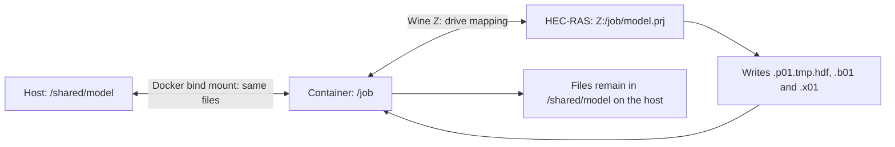
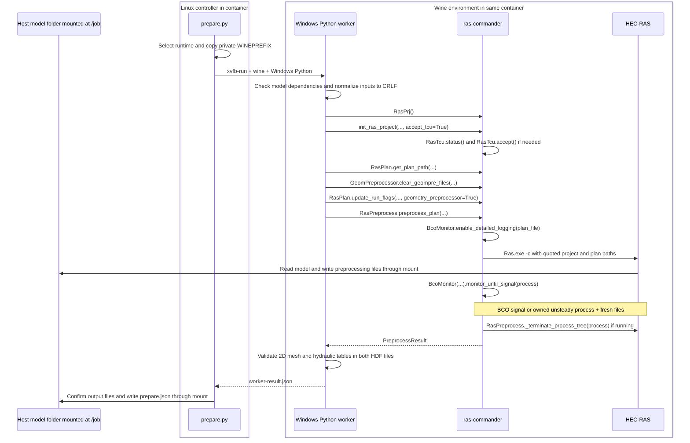

# HEC-RAS 6.5 Wine preprocessing

**HEC-RAS 6.5 is installed, TCU acceptance is saved, and preprocessing has been tested. The bundled image is available as `v4` and `latest`.**

This Linux/amd64 container lets [ras-commander][rc] call installed Windows
HEC-RAS through Wine. HEC-RAS performs the preprocessing. The container
provides the runtime and access to the host model folder.

## Models created on Windows or Linux

Pull the current `v4` image before testing. Use a disposable model copy and
mount its terrain and projection folders. With a model at `/job`, references
to `..\source_terrain` need `/source_terrain`; `..\projection` needs `/projection`.
The terrain HDF also needs its referenced TIFF files.

[model_checks.py][build-checks] checks the selected inputs, existing 2D geometry,
projection, terrain HDF and rasters before modifying model files. It normalizes
the selected `.prj`, `.p##`, `.g##` and `.u##` to Windows CRLF, preserving other
bytes. LF, CRLF and mixed inputs are accepted. The generated `.x##` remains LF.

Success requires both output HDFs to retain 2D areas and cell counts and contain
valid cell-volume and face-area elevation tables. Receipts record these checks.
File size and `/Results` presence are insufficient. See the
[full operating guide](https://github.com/gpt-cmdr/ras2fim-2d/blob/44c181fb52067189d8ad6ab15d696d6e924d77b6/containers/hecras-prepare/OPERATION.md).


## Wine, the HEC-RAS installation, and host data

[Wine](https://www.winehq.org/) supplies Windows application interfaces on Linux. It lets Windows Python
and the installed Windows HEC-RAS programs run inside this Linux container.
[ras-commander][rc] runs in Windows Python and calls HEC-RAS. HEC-RAS performs
the preprocessing; the container supplies the operating environment.

### Where HEC-RAS is installed

A Wine *prefix* is a directory holding a Windows-style C: drive, installed
programs, supporting DLLs, and Windows registry files. The image contains a
prepared prefix at `/runtime/wine-seed/prefix` and its settings in
`/runtime/wine-seed/runtime.json`.

| View | Installed executable path |
|---|---|
| Windows path seen by HEC-RAS and Python | `C:\Program Files (x86)\HEC\HEC-RAS\6.5\Ras.exe` |
| Linux path inside the image template | `/runtime/wine-seed/prefix/drive_c/Program Files (x86)/HEC/HEC-RAS/6.5/Ras.exe` |
| Linux path used by one running job | `/run/ras-job/<run-id>/wineprefix/drive_c/Program Files (x86)/HEC/HEC-RAS/6.5/Ras.exe` |

At startup the wrapper copies the prepared prefix into the job's private
scratch directory and sets `WINEPREFIX` to that copy. Wine can update its
registry and temporary state there. The installed template stays protected.
Windows Python is `C:\Python311\python.exe`; Xvfb supplies a virtual screen
for the Windows application. No interactive desktop is needed for a prepared job.

### How inputs and outputs cross the host mount

See the [Docker bind-mount reference](https://docs.docker.com/engine/storage/bind-mounts/) for host-path behavior.

For example, `--mount type=bind,src=/shared/model,dst=/job` makes the Docker
host's `/shared/model` directory visible inside the container as `/job`.
These are **the same underlying files**. There is no upload at startup or
separate download at completion: opening `/job/model.prj` reads the host file,
and writing `/job/model.p01.tmp.hdf` writes into the host directory.

Wine's Z: drive maps the container's Linux filesystem, so `winepath -w` can
translate `/job/model.prj` to `Z:\job\model.prj`. That drive sees the container's
filesystem and mounted folders. It does not expose unmounted host directories.



| Location | What happens to its files |
|---|---|
| Host model folder mounted at `/job` | Read/write. Inputs, edited plans, generated files, logs, and receipts remain on the host after the container exits. |
| Referenced terrain/projection mounts | Usually read-only; their mounted paths must match the model's references. |
| `/runtime/wine-seed` | Installed template included in the image; protected from job writes. |
| `/run/ras-job/<run-id>` | Private Wine prefix and intermediate worker files in temporary scratch. |
| `/tmp` | Temporary memory-backed storage for the running container. |

The bind-mount `src` path belongs to the machine running the Docker daemon.
When Docker is started over SSH, use that Linux host's path. A Windows
controller can access the same data through a network share. Its path and the
Linux host path must refer to the same shared folder.

Use a disposable model copy writable by UID 1000. The job edits preprocessing
settings and can replace generated files, including an existing final plan HDF
when `--replace-generated` is set. The documented `--rm` run removes the
container and its anonymous scratch volume; the bind-mounted model folder remains.

## Run a preprocessing job

```bash
docker pull rascommander/hec-ras-wine-precompute_6.5:v4

docker run --rm --network none --read-only \
  --user 1000:1000 --cpus 2 --memory 6g --memory-swap 6g \
  --cap-drop ALL --security-opt no-new-privileges \
  --tmpfs /tmp:rw,nosuid,nodev,size=512m,mode=1777 \
  --env RAS2FIM_JOB_ROOT=/job \
  --mount type=bind,src=/shared/model,dst=/job \
  --mount type=volume,dst=/run/ras-job \
  --device /dev/ntsync \
  rascommander/hec-ras-wine-precompute_6.5:v4 \
  prepare --project /job/model.prj --plan 01 \
          --timeout 900 --run-id example-001 --replace-generated
```

The qualified host supplies `/dev/ntsync`. Use a unique run ID and mount terrain
or projection dependencies at paths referenced by the model.

Review and agree to the [HEC-RAS Terms and Conditions for Use](https://www.hec.usace.army.mil/confluence/rasdocs/rasum/6.6/terms-and-conditions-of-use).
The installed profile retains vendor terms and notices.

## Installed code and GitHub source

The following links are pinned to the [current source snapshot][build-inputs]
in the public PR branch. The installed scripts match this source snapshot.

| Installed file | Source and purpose |
|---|---|
| `/opt/hecras-prepare/prepare.py` | [prepare.py][build-controller]: Linux job controller. |
| `/opt/hecras-prepare/model_checks.py` | [model_checks.py][build-checks]: model input and HDF validation. |
| `/opt/hecras-prepare/windows_worker.py` | [windows_worker.py][build-worker]: calls [ras-commander][rc]. |
| `C:\ras2fim-runtime\verify_windows_runtime.py` | [profile_provenance_check_legacy.py][build-helper]: unused preparation helper retained in the runtime. |

The library is installed under `C:\Python311\Lib\site-packages\ras_commander`.
Public file references: [RasPrj.py][ras-prj], [RasPlan.py][plan-path],
[geom/GeomPreprocessor.py][clear-geom], [RasPreprocess.py][preprocess],
[RasTcu.py][tcu-status], [RasBco.py][bco], and [ComputeResults.py][result].
The preprocessing, TCU, and BCO files match installed source after line-ending
normalization. The other four are upstream references; the retained wheel
contains the exact installed files.

## Exact ras-commander call sequence

The tables link every [ras-commander][rc] function shown below. Calls and arguments
were checked against the installed build; source availability is described above.



If Mermaid is unavailable in your viewer, the sequence is: Linux wrapper ->
Windows Python under Wine -> [ras-commander][rc] -> HEC-RAS -> files in the host
mount. The worker returns its result to the wrapper, which writes the job receipt.

| Direct worker API, in order | Actual arguments and purpose |
|---|---|
| [RasPrj()][ras-prj] | Creates the project object passed to subsequent calls as `ras_object`. |
| [init_ras_project()][init] | `project`, `ras_version=ras_executable`, `ras_object=ras_object`, `load_results_summary=False`, `load_hdf_metadata=False`, `hide_intro=True`, `accept_tcu=True`. Selects the installed executable and initializes project data. |
| [RasPlan.get_plan_path()][plan-path] | `plan, ras_object=ras_object`. Resolves the selected plan file; a missing plan stops the worker. |
| [GeomPreprocessor.clear_geompre_files()][clear-geom] | `plan_path, ras_object=ras_object`. Clears the matching geometry preprocessing cache and refreshes geometry metadata. |
| [RasPlan.update_run_flags()][run-flags] | `plan_path, geometry_preprocessor=True, ras_object=ras_object`. Enables geometry preprocessing in the working plan. |
| [RasPreprocess.preprocess_plan()][preprocess] | `plan, ras_object=ras_object, max_wait=timeout, clear_existing=replace_generated, fix_line_endings=True`. Starts and supervises HEC-RAS and returns its preprocessing result. |

The wrapper launches Windows Python with
`xvfb-run -a -s "-screen 0 1024x768x24" wine`, followed by the manifest's Python
path and translated worker arguments. Inside [RasPreprocess.preprocess_plan()][preprocess],
a Windows Python subprocess launches the full executable path as
`"Ras.exe" -c "<project.prj>" "<project.p01>"` with `shell=False`.

[BcoMonitor.monitor_until_signal()][monitor] watches for
`Starting Unsteady Flow Computations`. The alternate signal requires a
`RasUnsteady.exe` descendant of this job's launcher and three nonempty output
files changed from their prelaunch size/mtime baseline. The library uses
`psutil` for process ownership and cleanup. The readiness limit is `max_wait`;
the outer Windows worker subprocess has a separate `timeout + 120` second limit.

**The unsteady solver may start briefly before it is stopped.** This workflow
obtains preprocessing inputs for a separate calculation stage. A detected TCU
dialog blocks the job. The wrapper requires the expected plan, geometry and
output paths, an accepted `bco` or `owned_process_artifacts` readiness signal,
`timed_out=False`, `full_result_copied=False`, and successful HDF-content validation before reporting success.

## What remains on the host

For plan 01 and geometry 01, HEC-RAS produces:

| File in the mounted model folder | Purpose |
|---|---|
| `model.p01.tmp.hdf` | Temporary plan HDF produced during preprocessing. |
| `model.b01` | Plan binary input for the calculation stage. |
| `model.x01` | Geometry control input, converted to Linux LF line endings. |
| `.ras-commander/runs/<run-id>/prepare.json` | Job receipt recording success/failure, selected runtime, completion signal, and output details. |

Project names and plan/geometry numbers determine the filenames. Other working
files and calculation logs may also remain. Worker stdout/stderr are saved
beside the receipt when the worker subprocess returns normally; early validation
failures or forced timeouts can have less logging.

Exit code 0 means verified success, 1 a recorded job failure, and 2 a configuration
or I/O error. The Windows Step 2b controller waits for the full batch before it
stages files for the separate Linux calculation. Qualification here covers the
retained preprocessing sample; model suitability and compatibility with the
later native HEC-RAS 6.5 engine require their own checks.

## Tested readiness

The selected runtime completed the retained generated-plan sample in 58.41
seconds on September 9, 2026, with two CPUs, 6 GiB RAM, a read-only root,
UID 1000, networking disabled, and no external runtime mount. A fresh runtime
copy had saved TCU acceptance without invoking [RasTcu.accept()][tcu-accept].
This qualifies that sample and host; it is not a hydraulic comparison between
HEC-RAS releases.

---

## How to Re-Create this Container

This section is for rebuilding the image. Routine users can start with the
installed image and the run command above.

**The repeatable build currently starts with a retained, prepared Wine profile.**
A complete installation recipe starting with an empty Wine prefix has not yet
been demonstrated. The steps below identify the inputs, build procedure, and
remaining work needed for that fully independent reconstruction.

### 1. Gather the build inputs

Use the [GitHub source snapshot][build-inputs] containing these files under
`containers/hecras-prepare/`. The source links point to the public PR branch. External inputs link to their example or layout documentation.

| Input | Purpose |
|---|---|
| [Dockerfile][build-dockerfile] | Linux tools, user 1000, bundled Wine profile, and entrypoint. |
| [prepare.py][build-controller] | Linux job controller, private runtime setup, worker launch, and receipts. |
| [model_checks.py][build-checks] | Normalizes HEC-RAS inputs and validates dependencies, mesh and hydraulic tables. |
| [windows_worker.py][build-worker] | Calls the linked [ras-commander][rc] APIs under Wine. |
| [bundle_profile.py][build-exporter] | Exports a prepared runtime into the external build context. |
| External [runtime.json][build-manifest] and [prefix/][build-inputs] | Installed HEC-RAS 6.5 and dependencies. Links show the manifest example and layout; actual runtime contents stay outside Git. |
| Retained [ras_commander-0.99.2-py3-none-any.whl][build-inputs] | External wheel from build `9e4217713e954236b0c16023e1815c6f2b7a5309`; the link documents this input, not a wheel download. |

The Dockerfile pins Python 3.13.15 on Debian Trixie, Wine, Xvfb, xauth, procps
and tini. Exact reconstruction requires the retained wheel and prepared profile;
the dependency inventory appears below.

### 2. Prepare or recover the installed Wine profile

The retained profiles contain Windows Python 3.11.9, .NET 4.8, Visual C++
runtimes, GDI+, fonts, HEC-RAS, and accepted TCU state. Preserve the original;
work on a separate copy. Preserve `dosdevices/c: -> ../drive_c` and
`dosdevices/z: -> /` as links without following them during copies.

To create a replacement from an empty prefix, install those prerequisites,
the selected official HEC-RAS release, and the retained
[ras-commander][rc-github] wheel. Complete any installer and first-launch TCU
prompts, then close Wine cleanly and verify the saved state with
[RasTcu.status()][tcu-status]. The retained profile's dependency list is an
inventory; it does not yet supply all prerequisite download URLs or a tested
installer sequence.

Preparation details retained from the working profiles:

- The wheel was installed with Windows Python using `pip install --no-index
  --no-deps --no-cache-dir --disable-pip-version-check --force-reinstall
  --no-compile`. Dependencies were already installed; an empty prefix needs them.
- Wine bootstrap used `WINEDLLOVERRIDES="mscoree,mshtml,winemenubuilder.exe,winedbg.exe="`
  for `wineboot`, then Winetricks prerequisites. Do not disable `mscoree` during
  normal HEC-RAS 7.0.1 execution: its startup helper requires .NET.
- The 7.0.1 launcher stalled on its .NET 4.8.1 web prerequisite. Its extracted
  official MSI was installed directly; that .NET 4.8 profile passed the sample.
- TCU state was inherited for 6.5; the 6.6 installer/first launch and 7.0.1 first
  launch were accepted. [RasTcu.accept()][tcu-accept] persisted state where needed.
  Run `wineserver -k` then `wineserver -w` while the container remains alive to
  finish registry writes. Fresh-copy checks use [RasTcu.status()][tcu-status].
- Saved values `650`, `660`, and `701` are specific to each Windows user and
  installed executable path. Verification did not accept terms again.

Finalize `runtime.json` after installation: schema `ras-commander-runtime/v1`,
`kind: wine`, `hec_ras_version: "6.5"`, selected executable/Python/wheel
paths, build identity, and actual artifact records. A retained finalized profile
already supplies this manifest. If installed files change, regenerate the
manifest before export. A portable manifest-generation command remains part
of the reconstruction work; the example manifest's zero values are placeholders.

### 3. Export the profile and build the image

Run from the repository root on Linux. The source is the finalized profile
from step 2. The destination must be a new directory outside Git. Export removes
temporary installers, caches, files covered by the personal-file filters, and
unrelated HEC-RAS program directories while retaining vendor notices. Review the
exported contents before publishing.

```bash
python containers/hecras-prepare/bundle_profile.py \
  --source /controlled/hecras-6.5-wine \
  --destination /controlled/releases/hecras-6.5 \
  --version 6.5

docker buildx build --load --platform linux/amd64 \
  --build-context hecras_runtime=/controlled/releases/hecras-6.5 \
  --build-arg HEC_RAS_VERSION=6.5 \
  --build-arg RAS_COMMANDER_COMMIT=9e4217713e954236b0c16023e1815c6f2b7a5309 \
  --build-arg RAS_COMMANDER_WHEEL_SHA256=dc0c2f9baa9db66afee01e34eb00d7a04f53e7b82c3340c786b2e9aef1795932 \
  --tag local/hecras-6.5:review \
  --file containers/hecras-prepare/Dockerfile .
```

The external `hecras_runtime` context supplies the installed files; the Dockerfile
places them at `/runtime/wine-seed`, owned by root and readable by the worker.
The entrypoint is `tini -- python /opt/hecras-prepare/prepare.py`. A normal job
uses its own writable prefix and runs without downloads or installation.

### 4. Validate the reconstructed image

The repository's `verify_bundled_runtime.sh` and `verify_windows_runtime.py`
check the selected installation and saved TCU state from a fresh runtime copy.
Use a Linux Docker host with `/dev/ntsync`; run as host UID 1000 or root. The
audit directory must be new and outside Git:

```bash
bash containers/hecras-prepare/verify_bundled_runtime.sh \
  local/hecras-6.5:review 6.5 /scratch/hecras-audit-6.5-001
```

Then use the run command above with `local/hecras-6.5:review` and a
disposable validation model. Require the expected three output files, a successful
receipt with HDF-content validation, no timeout, and no copied full-simulation result. Test with networking
disabled and no external runtime mount. Retain the build log, installed-software
inventory, TCU check, image identity, and sample-run evidence outside Git.

### Remaining work for a build starting from nothing

A clean-host rebuild still needs locked installers/dependencies, an empty-prefix
installation sequence, portable manifest generation, and a distributable validation
fixture. The original 6.5 setup EXE identity is missing; an MSI-cache identity
is retained. The existing images passed the documented preprocessing sample.

### Installed software for reconstruction

| Component | Installed version |
|---|---|
| Linux base and Python | Debian Trixie; Python 3.13.15; pip 26.2.1. |
| Wine | WineHQ stable 11.0, 32-bit and 64-bit support. |
| Virtual display and processes | Xvfb 21.1.16, xauth, procps, tini; exact revisions in Dockerfile. |
| Windows Python | 3.11.9, 64-bit, at `C:\Python311`. |
| .NET Framework | 4.8, registered as 4.8.03761. |
| Visual C++ runtimes | 2010 x86/x64 10.0.40219; 2013 12.0.30501.0; 2015-2019 14.24.28127.4. |
| Graphics and fonts | Native GDI+ and core fonts installed with Winetricks. |
| [ras-commander][rc] | 0.99.2, installed from the retained wheel. |

The recorded inventory contains 512 Linux packages, 49 Windows Python
distributions, and 24 Windows component registration records. The complete
`runtime-inventory-20260910.json` accompanies the source review. Registered
components can retain installation history; this is not a minimal dependency list.

### Windows Python distributions

affine 3.0.0, attrs 26.1.0, certifi 2026.7.22, cffi 2.1.1, charset-normalizer 3.5.1, click 8.4.2, click-plugins 1.1.1.2, cligj 0.7.2, clr_loader 0.2.10, colorama 0.4.6, contourpy 1.3.3, cycler 0.12.1, fonttools 4.63.0, fsspec 2026.7.0, geopandas 1.1.4, h5py 3.16.0, hms-commander 0.3.1, idna 3.19, kiwisolver 1.5.0, matplotlib 3.11.1, numpy 2.4.6, packaging 26.3, pandas 3.0.5, pathlib 1.0.1, pefile 2024.8.26, pillow 12.3.0, pip 24.0, psutil 7.2.2, pycparser 3.0, pyogrio 0.13.0, pyparsing 3.3.2, pyproj 3.7.2, python-dateutil 2.9.0.post0, pythonnet 3.0.5, pywin32 312, [ras-commander][rc] 0.99.2, rasterio 1.4.4, rasterstats 0.21.0, requests 2.34.2, rtree 1.4.1, scipy 1.17.1, setuptools 65.5.0, shapely 2.1.2, simplejson 4.1.1, six 1.17.0, tqdm 4.70.0, tzdata 2026.3, urllib3 2.7.0, xarray 2026.7.0.

### Recorded build identity

To retrieve the exact published release for reconstruction, use:

```text
rascommander/hec-ras-wine-precompute_6.5@sha256:50622b26c2c210c9034a38500aa8048e84c129dc0fbf2aa348fbc3c1e368c597
```

Contributed by CLB Engineering Corporation for ras2fim-2d.

[rc]: https://rascommander.info/ras/
[rc-github]: https://github.com/gpt-cmdr/ras-commander
[ras-prj]: https://github.com/gpt-cmdr/ras-commander/blob/bab6179027fadfda2b143beccde42ce12e457a0f/ras_commander/RasPrj.py#L125
[init]: https://github.com/gpt-cmdr/ras-commander/blob/bab6179027fadfda2b143beccde42ce12e457a0f/ras_commander/RasPrj.py#L2462
[plan-path]: https://github.com/gpt-cmdr/ras-commander/blob/bab6179027fadfda2b143beccde42ce12e457a0f/ras_commander/RasPlan.py#L787
[clear-geom]: https://github.com/gpt-cmdr/ras-commander/blob/bab6179027fadfda2b143beccde42ce12e457a0f/ras_commander/geom/GeomPreprocessor.py#L1152
[run-flags]: https://github.com/gpt-cmdr/ras-commander/blob/bab6179027fadfda2b143beccde42ce12e457a0f/ras_commander/RasPlan.py#L1394
[preprocess]: https://github.com/gpt-cmdr/ras-commander/blob/bab6179027fadfda2b143beccde42ce12e457a0f/ras_commander/RasPreprocess.py#L97
[tcu-status]: https://github.com/gpt-cmdr/ras-commander/blob/bab6179027fadfda2b143beccde42ce12e457a0f/ras_commander/RasTcu.py#L270
[tcu-accept]: https://github.com/gpt-cmdr/ras-commander/blob/bab6179027fadfda2b143beccde42ce12e457a0f/ras_commander/RasTcu.py#L449
[bco]: https://github.com/gpt-cmdr/ras-commander/blob/bab6179027fadfda2b143beccde42ce12e457a0f/ras_commander/RasBco.py#L25
[monitor]: https://github.com/gpt-cmdr/ras-commander/blob/bab6179027fadfda2b143beccde42ce12e457a0f/ras_commander/RasBco.py#L144
[result]: https://github.com/gpt-cmdr/ras-commander/blob/bab6179027fadfda2b143beccde42ce12e457a0f/ras_commander/ComputeResults.py#L185

[build-dockerfile]: https://github.com/gpt-cmdr/ras2fim-2d/blob/3c5011dbe150d8311e45598401b16645c6e61932/containers/hecras-prepare/Dockerfile
[build-controller]: https://github.com/gpt-cmdr/ras2fim-2d/blob/3c5011dbe150d8311e45598401b16645c6e61932/containers/hecras-prepare/prepare.py
[build-worker]: https://github.com/gpt-cmdr/ras2fim-2d/blob/3c5011dbe150d8311e45598401b16645c6e61932/containers/hecras-prepare/windows_worker.py
[build-exporter]: https://github.com/gpt-cmdr/ras2fim-2d/blob/3c5011dbe150d8311e45598401b16645c6e61932/containers/hecras-prepare/bundle_profile.py
[build-manifest]: https://github.com/gpt-cmdr/ras2fim-2d/blob/3c5011dbe150d8311e45598401b16645c6e61932/containers/hecras-prepare/runtime-manifest.example.json
[build-helper]: https://github.com/gpt-cmdr/ras2fim-2d/blob/3c5011dbe150d8311e45598401b16645c6e61932/containers/hecras-prepare/profile_provenance_check_legacy.py
[build-inputs]: https://github.com/gpt-cmdr/ras2fim-2d/blob/3c5011dbe150d8311e45598401b16645c6e61932/containers/hecras-prepare/BUILD-INPUTS.md

[build-checks]: https://github.com/gpt-cmdr/ras2fim-2d/blob/3c5011dbe150d8311e45598401b16645c6e61932/containers/hecras-prepare/model_checks.py
